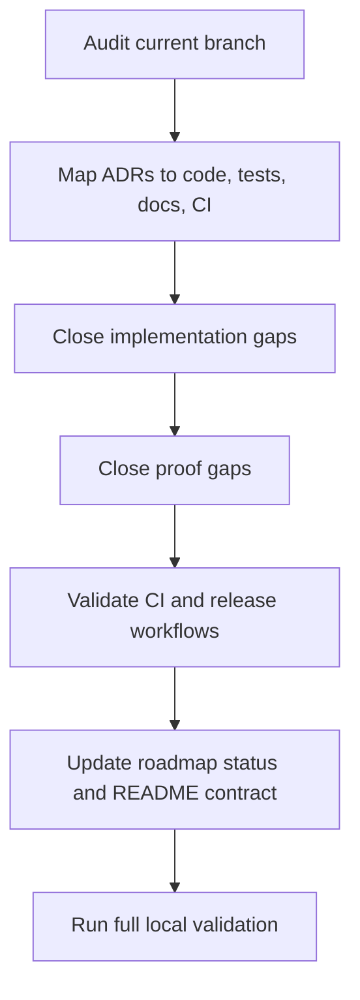

# Roadmap Completion Plan

## Goal

Complete the previous architecture plan and all accepted ADRs for the current product direction: a repo-local Rust CLI plus composite GitHub Action used by developers and CI systems. Completion means every accepted decision is represented in code, tests, CI/release workflows, documentation, and local validation.

This plan does not add a hosted API, Docker/cloud infrastructure, or GUI. Those are explicitly future-only under ADR-0001 and ADR-0002 unless the product direction changes.

## Completion Definition

The roadmap is complete when:

- Every accepted ADR has implementation evidence in the repo.
- Every roadmap phase has acceptance criteria and proof commands.
- CI workflows can validate architecture promises without relying on manual interpretation.
- README and architecture docs explain the product contract for local and CI users.
- Remaining future work is explicitly marked as future by decision, not left as ambiguous unfinished scope.

## ADR Completion Matrix

### ADR-0001: Keep `imageopt-core` Frontend-Agnostic

Files:

- [docs/architecture/adr/0001-frontend-agnostic-core.md](/Users/dominik/Development/newmatik/image-optimizer/docs/architecture/adr/0001-frontend-agnostic-core.md)
- [crates/core/src/lib.rs](/Users/dominik/Development/newmatik/image-optimizer/crates/core/src/lib.rs)
- [crates/cli/src/main.rs](/Users/dominik/Development/newmatik/image-optimizer/crates/cli/src/main.rs)
- [crates/cli/tests/cli.rs](/Users/dominik/Development/newmatik/image-optimizer/crates/cli/tests/cli.rs)

Acceptance criteria:

- `crates/core` remains free of CLI, shell, progress-bar UI, GitHub Action, HTTP, async runtime, and hosted-service dependencies.
- CLI-only behavior stays in `crates/cli`: path expansion, process exit codes, JSON/table output, and progress display.
- CLI behavior has integration tests through the binary, not only unit tests.
- Architecture docs clearly state that server/GUI frontends must be separate frontends around `imageopt-core`.

Completion work:

- Add/verify a dependency-boundary check in docs or CI to ensure `imageopt-core` does not gain CLI-only dependencies such as `clap`, `indicatif`, `anstream`, `walkdir`, or `globset`.
- Ensure CLI integration tests cover `--json`, `--check`, skipped files, and non-mutating check mode.
- Update the roadmap to say server/GUI diagnostics are future scope by ADR, not incomplete current scope.

### ADR-0002: Treat GitHub Releases as the Infrastructure Layer

Files:

- [docs/architecture/adr/0002-github-releases-as-infrastructure.md](/Users/dominik/Development/newmatik/image-optimizer/docs/architecture/adr/0002-github-releases-as-infrastructure.md)
- [.github/workflows/release.yml](/Users/dominik/Development/newmatik/image-optimizer/.github/workflows/release.yml)
- [action.yml](/Users/dominik/Development/newmatik/image-optimizer/action.yml)
- [.github/workflows/action-smoke.yml](/Users/dominik/Development/newmatik/image-optimizer/.github/workflows/action-smoke.yml)

Acceptance criteria:

- Release matrix builds artifacts but does not publish directly from each matrix job.
- A single publish job uploads release assets after all matrix builds pass.
- Release tag must match crate version before artifacts publish.
- Unix and Windows checksums use a consistent `hash filename` format.
- Composite action verifies downloaded checksums before execution.
- Composite action supports Linux, macOS, and Windows release assets.
- Action smoke workflow validates consumer usage patterns.

Completion work:

- Verify `release.yml` publish job has enough permissions and uses the resolved tag consistently for both push tags and `workflow_dispatch`.
- Strengthen `action-smoke.yml`: because the current action downloads release assets, local `uses: ./` smoke tests must either pin `version` to a release known to exist or include a documented limitation that it validates action plumbing against released binaries, not the just-built local binary.
- Add a release dry-run or workflow-level note documenting that full release behavior is validated on tag builds.
- Consider adding artifact attestations only if required by project policy; otherwise record it as future hardening.

### ADR-0003: Make Skipped Semantics Explicit

Files:

- [docs/architecture/adr/0003-explicit-skipped-semantics.md](/Users/dominik/Development/newmatik/image-optimizer/docs/architecture/adr/0003-explicit-skipped-semantics.md)
- [crates/core/src/codecs/mod.rs](/Users/dominik/Development/newmatik/image-optimizer/crates/core/src/codecs/mod.rs)
- [crates/core/src/engine.rs](/Users/dominik/Development/newmatik/image-optimizer/crates/core/src/engine.rs)
- [crates/core/src/codecs/gif.rs](/Users/dominik/Development/newmatik/image-optimizer/crates/core/src/codecs/gif.rs)
- [crates/core/src/codecs/svg.rs](/Users/dominik/Development/newmatik/image-optimizer/crates/core/src/codecs/svg.rs)
- [crates/cli/src/report.rs](/Users/dominik/Development/newmatik/image-optimizer/crates/cli/src/report.rs)
- [crates/core/tests/engine.rs](/Users/dominik/Development/newmatik/image-optimizer/crates/core/tests/engine.rs)

Acceptance criteria:

- Codec API supports both candidate outputs and intentional non-fatal skips.
- Animated GIFs report `Skipped` with a reason.
- Unsafe SVGs report `Skipped` with a reason.
- Non-UTF-8 SVGs report `Skipped` with a reason.
- Unsupported detected formats such as AVIF report `Skipped` with a reason.
- CLI table and JSON output preserve skipped reasons.
- `--check` fails on optimizable or failed files, but not on intentionally skipped files.

Completion work:

- Add or verify tests for all explicit skip cases listed above.
- Add a CLI JSON test that asserts skipped reason text appears in `results[].error`.
- Verify README documents `Skipped` status and `--check` semantics clearly.

### ADR-0004: Treat Repeated-Run Lossy Safety as a Core Invariant

Files:

- [docs/architecture/adr/0004-repeated-run-lossy-safety.md](/Users/dominik/Development/newmatik/image-optimizer/docs/architecture/adr/0004-repeated-run-lossy-safety.md)
- [crates/cli/src/args.rs](/Users/dominik/Development/newmatik/image-optimizer/crates/cli/src/args.rs)
- [crates/core/src/codecs/jpeg.rs](/Users/dominik/Development/newmatik/image-optimizer/crates/core/src/codecs/jpeg.rs)
- [crates/core/tests/engine.rs](/Users/dominik/Development/newmatik/image-optimizer/crates/core/tests/engine.rs)
- [README.md](/Users/dominik/Development/newmatik/image-optimizer/README.md)

Acceptance criteria:

- Lossless remains the default.
- `--lossy` remains explicit opt-in.
- CLI lossy mode defaults `min_savings_percent` to `10.0`.
- `--quality` implies lossy and uses the same convergence threshold.
- Explicit `--min-savings` overrides the default.
- JPEG lossy mode skips destructive re-encoding when source quantization appears at or below target quality.
- Repeated lossy-mode runs do not apply destructive JPEG recompression for marginal savings.
- README explains the CI risk and safe defaults.

Completion work:

- Keep the current JPEG quantization guard, but add small unit tests for the parser/estimator if the helpers remain private but testable within `jpeg.rs`.
- Keep integration coverage that checks decoded-pixel stability on repeated JPEG lossy-mode runs.
- Add a WebP repeated-run test if feasible; if WebP source-quality detection is not possible with current dependencies, document that min-savings threshold is the current WebP guard.

## Roadmap Phase Completion Plan



### Phase 1: Correctness and Product Truth

Acceptance criteria:

- README no longer claims AVIF optimization exists.
- AVIF detection is documented as detected but skipped until optimizer support exists.
- Intentional skips are visible in CLI and JSON.
- Invalid globs and directory walk errors are reported to stderr.

Completion tasks:

- Verify AVIF documentation in README and roadmap.
- Verify path expansion diagnostics do not break JSON stdout contract.
- Add CLI tests if current test coverage does not assert stderr/JSON separation.

### Phase 2: Test Coverage Expansion

Acceptance criteria:

- Core integration tests cover PNG, JPEG, WebP, static GIF, animated GIF, safe SVG, unsafe SVG, corrupt JPEG, unknown format, AVIF, backup/no-clobber, dry-run, in-place writes, batch ordering, progress events, and max-pixels rejection.
- CLI integration tests cover JSON summary, `--check`, skipped files, and no mutation in check mode.
- Fuzz target exists for `optimize_bytes`.

Completion tasks:

- Add missing tests from the acceptance list.
- Add skipped-reason JSON assertion.
- Add `cargo fuzz` instructions to architecture docs and README or contributor docs.

### Phase 3: CI/CD Hardening

Acceptance criteria:

- CI has concurrency cancellation.
- CI runs stable multi-OS fmt/clippy/test.
- CI runs MSRV tests.
- CI runs `cargo audit` and `cargo deny check` using committed policy files.
- CI uploads coverage artifact from `cargo llvm-cov`.
- Action smoke workflow validates consumer action usage.

Completion tasks:

- Verify `cargo deny check` and `cargo audit` pass locally.
- Ensure `.cargo/audit.toml` and `deny.toml` include rationale for every ignore or allowance.
- Decide whether duplicate dependency versions are allowed, warned, or denied; keep CI output actionable.
- Review action smoke workflow for the released-binary vs local-action limitation.

### Phase 4: Release and Supply-Chain Hardening

Acceptance criteria:

- Release workflow runs tests before packaging.
- Release workflow verifies tag equals crate version.
- Release workflow publishes from one final job.
- Composite action verifies checksums before execution.
- Composite action supports Windows `.zip` and `.exe` assets.

Completion tasks:

- Verify release workflow syntax and tag handling.
- Review Windows extraction path in `action.yml` and ensure the shell used by composite action supports `uname`, `find`, checksum commands, and PowerShell fallback.
- Optionally add artifact attestation if project policy requires it; otherwise document as deferred.

### Phase 5: Observability and CI Consumer Contract

Acceptance criteria:

- JSON output includes a top-level `summary` and per-file `results`.
- JSON summary includes totals, optimized/skipped/failed counts, original and optimized bytes, saved bytes/percent, elapsed time, and per-format counts.
- README documents JSON schema and status values.
- Server/GUI structured diagnostics are explicitly future-only.

Completion tasks:

- Add or verify CLI integration test for JSON summary shape.
- Add skipped-reason JSON test.
- Ensure README says skipped files do not fail `--check`, failed files do.

## Final Validation Checklist

Run before declaring completion:

```bash
cargo fmt --all --check
cargo fmt --all --check --manifest-path fuzz/Cargo.toml
cargo clippy --all-targets --all-features -- -D warnings
cargo test --all-features
cargo check --manifest-path fuzz/Cargo.toml
cargo deny check
cargo audit
cargo metadata --no-deps --format-version 1
```

Review before declaring completion:

- `git diff --stat`
- `git diff -- .github/workflows/ci.yml .github/workflows/release.yml .github/workflows/action-smoke.yml action.yml`
- `git diff -- docs/architecture README.md`
- `git diff -- crates/core crates/cli`

## Explicit Non-Goals

- Do not add a hosted API in this completion pass.
- Do not add Docker, Terraform, Cloudflare, Supabase, or Sentry infrastructure.
- Do not add a GUI frontend.
- Do not preserve compatibility with incorrect unshipped branch behavior if it conflicts with accepted ADRs.

## Completion Output

When done, provide:

- A short ADR-by-ADR completion summary.
- The exact validation commands and results.
- Any remaining deferred items, only if they are explicitly future scope by ADR.
- A note about workflow behavior that cannot be fully proven locally, such as tag-triggered GitHub Release publishing.