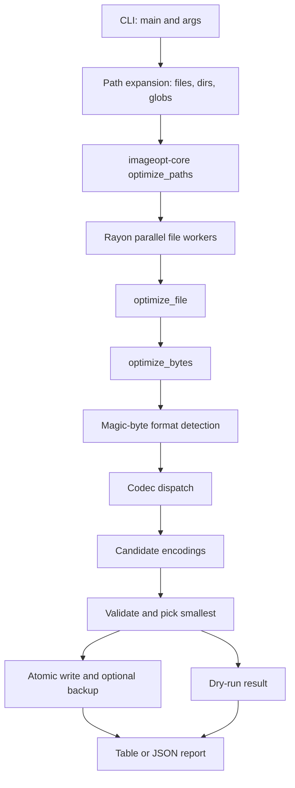

# Architecture Improvement Roadmap

This roadmap captures the current improvement direction for `imageopt`. The
project is a repo-local CLI and GitHub Action, not a hosted service. The main
architectural goal is to make local and CI usage safe, predictable, and easy to
trust across repeated runs.

## Current Shape

## Product Constraints

- Keep lossless optimization as the default.
- Keep lossy optimization explicit and safe for repeated CI runs.
- Preserve the `imageopt-core` boundary so the engine remains reusable.
- Treat GitHub Releases and the composite GitHub Action as the infrastructure
  layer.
- Keep CI behavior deterministic for consumer repositories.
- Prefer clear `Skipped` and `Failed` reasons over ambiguous output.
- Avoid adding hosted infrastructure until there is a concrete hosted-product
  requirement.

## Phase 1: Correctness and Product Truth

Status: Implemented in the current architecture branch.

- Fix the AVIF mismatch: either implement an `avif` feature and codec or remove
  AVIF optimization claims until support exists.
- Report animated GIFs, unsafe SVGs, non-UTF-8 SVGs, and unsupported detected
  formats as explicit `Skipped` results with reasons.
- Promote repeated-run lossy safety in documentation: `--lossy` is opt-in,
  defaults to a meaningful `--min-savings`, and is intended to converge in CI.
- Report invalid globs and directory walk errors instead of silently dropping
  them.

## Phase 2: Test Coverage Expansion

Status: Implemented for the current CLI/action architecture, with generated
fixtures covering core codec, I/O, batch, and CLI behavior.

- Add minimal generated fixtures for JPEG, PNG, WebP, GIF, SVG, corrupt images,
  and metadata/status edge cases.
- Split tests by concern: engine behavior, codec behavior, engine I/O, and CLI
  integration.
- Cover codec paths: smaller output, valid re-decode, idempotent second run,
  lossy mode, metadata policy behavior, explicit skipped statuses, and
  repeated-run JPEG quality stability.
- Add regression tests for lossy convergence so default lossy settings do not
  repeatedly rewrite JPEG/WebP files for marginal savings.
- Cover backup creation, no-clobber `.orig`, permission preservation, dry-run
  no-write, in-place shrink, and write-failure reporting.
- Cover batch behavior: order preservation, progress events, mixed
  success/failure, `--check` exit behavior, and action-style CI gate usage.
- Add fuzzing for `optimize_bytes` with arbitrary bytes to look for panic
  escapes and codec boundary issues. Run with
  `cargo fuzz run optimize_bytes` from the repository root after installing
  `cargo-fuzz`.

## Phase 3: CI/CD Hardening

Status: Implemented for CI jobs, local/CI supply-chain checks, coverage
artifacts, and action smoke coverage.

- Add CI concurrency cancellation.
- Add an MSRV job using the workspace `rust-version`.
- Add `cargo audit` and `cargo deny check` with an intentional license policy.
- Add coverage reporting with `cargo llvm-cov`, initially as an artifact rather
  than a hard threshold.
- Add a composite-action smoke workflow that exercises `check`, `dry-run`,
  normal lossless mode, and explicit lossy threshold behavior.
- Run tests in the release workflow before packaging.

## Phase 4: Release and Supply-Chain Hardening

Status: Implemented for release orchestration, version checks, checksum
verification, and Windows action support.

- Change releases from direct matrix uploads to a build matrix plus one final
  publish job.
- Add a tag/version consistency check so release tags match crate versions.
- Normalize checksum files across Unix and Windows.
- Update the composite action to verify downloaded checksums before executing
  binaries.
- Add Windows support to the composite action.
- Consider artifact attestations after checksum verification and single-job
  publishing are in place.

## Phase 5: Observability and Future Frontends

Status: JSON summary output and documentation are implemented. Server/GUI
diagnostics remain future-facing until those frontends exist.

- Extend JSON output with aggregate summary data: total files,
  optimized/skipped/failed counts, total elapsed time, per-format counts, and
  total bytes saved.
- Document the JSON contract and CI gate semantics for consumer repositories.
- Add optional structured diagnostics only when a server, GUI, or long-running
  frontend needs them.
- If a hosted API becomes a requirement, create a separate frontend crate around
  `optimize_bytes` with explicit upload limits, queue/backpressure policy,
  timeout policy, and abuse controls.

## Risk Mitigation

- Add tests before changing engine status semantics or release behavior.
- Treat “no repeated destructive recompression” as part of correctness.
- Keep CI, security, and release hardening independently deployable.
- Preserve the simple codec candidate model while improving user-facing
  statuses.
- Keep license policy explicit when adding dependency checks.
